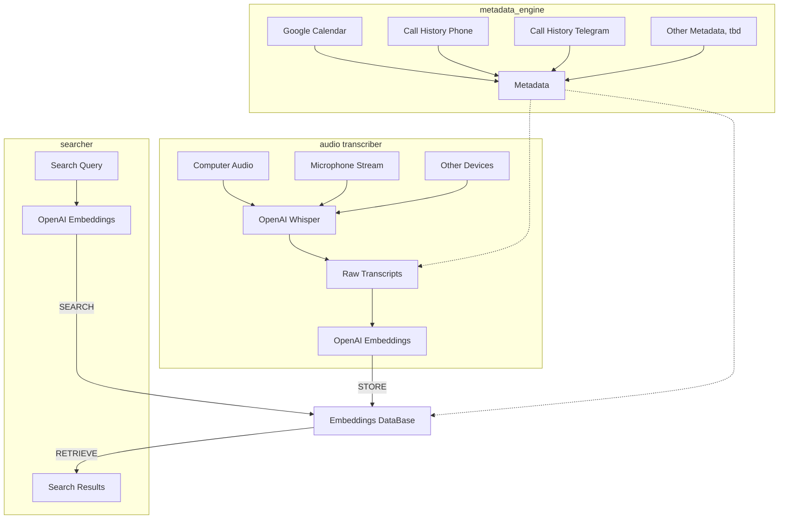

# life-transcriber
Project to transcribe, embed and search my life

## Project Structure

```mermaid
graph TD
    subgraph audio transcriber
        CA[Computer Audio] --> W[OpenAI Whisper]
        MS[Microphone Stream] --> W
        OD[Other Devices] --> W
        W --> RT[Raw Transcripts]
        RT --> E1[OpenAI Embeddings]
    end

    subgraph searcher
        UI[Search Query] --> E2[OpenAI Embeddings]
        SR[Search Results]
    end

    E1 --STORE--> EDB[Embeddings DataBase]
    E2 --SEARCH----> EDB
    EDB --RETRIEVE--> SR

    subgraph metadata_engine
        MT[Metadata]
        GC[Google Calendar] --> MT
        CHP[Call History Phone] --> MT
        CHT[Call History Telegram] --> MT
        OMD[Other Metadata, tbd] --> MT
    end

    MT -...-> RT
    MT -.-> EDB


```
