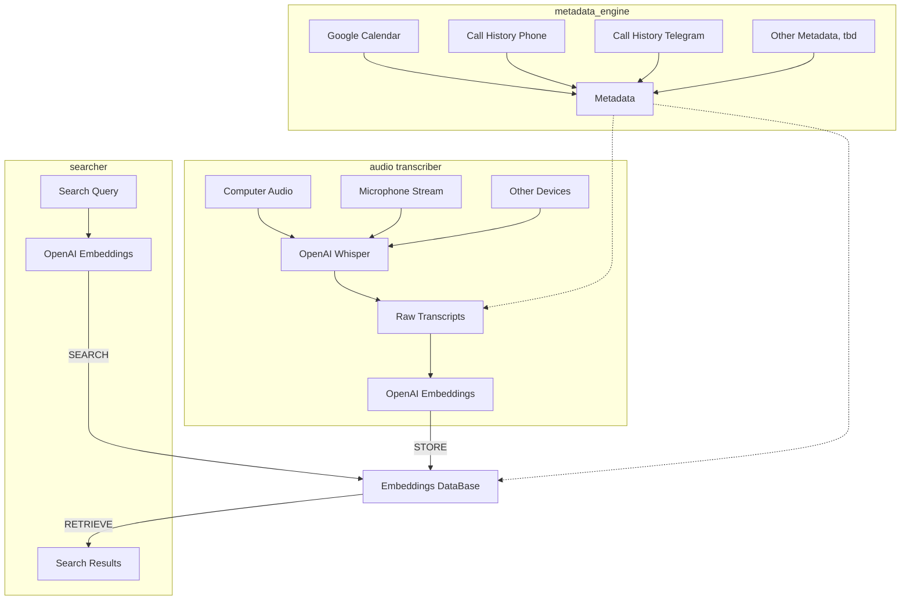

# life-transcriber
Project to transcribe, embed and search my life

## Project Structure

## Components

* audio transcriber
  * script runs in background and saves all audio as time-stamped small files
  * audio is transcribed and converted into raw text, stored in a database
  * raw text converted to embeddings, stored in a vector DB
* metadata engine
  * parse life metadata
  * calendar
  * geolocation
  * call history
  * other?
  * upload metadata to both transcript and vector DB for context/filtering
* searcher
  * convert search queries into embeddings to search the vector DB for closest matches
  * also add metadata filters/sorting

## ToDo

* choose storage format for raw text, timestamps and metadata
* choose a vector DB for the project
